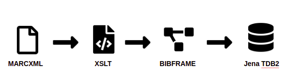

# National Librarian’s Research Fellowship in Digital Scholarship 2022-23

[](https://mybinder.org/v2/gh/hibernator11/nls-fellowship-2022-23/HEAD)

Created in October-December 2022 for the National Library of Scotland's Data Foundry by [Gustavo Candela, National Librarian’s Research Fellowship in Digital Scholarship 2022-23](https://data.nls.uk/projects/the-national-librarians-research-fellowship-in-digital-scholarship-2022-23/)

To explore the collections listed below in live Jupyter Notebooks, open them here in [Binder](https://mybinder.org/v2/gh/hibernator11/nls-fellowship-2022-23/HEAD) (please note this may take several minutes to load).

To copy and work with the Jupyter Notebooks on your own machine, see [Setup](#setup).

### Table of Contents
- [Datasets](#datasets)
- [Setup](#setup)
- [Suggested Citations](#suggested-citations)
- [Moving Image Archive](#moving-image-archive)
- [National Bibliography of Scotland](#national-bibliography-of-scotland)
- [References](#references)

## Datasets

### Collection 1: Moving Image Archive
- Owner: National Library of Scotland
- Creator: National Library of Scotland
- Website: Visit the [NLS Data Foundry](https://data.nls.uk/data/metadata-collections/moving-image-archive/)
- Licence: [Public Domain](https://creativecommons.org/publicdomain/mark/1.0/)

### Collection 2: The National Bibliography of Scotland (version 2)
- Owner: National Library of Scotland
- Creator: National Library of Scotland
- Website: Visit the [NLS Data Foundry](https://data.nls.uk/data/metadata-collections/national-bibliography-of-scotland/)
- DOI: https://doi.org/10.34812/7cda-ep21
- Date created: 2022
- Licence: Creative Commons Attribution 4.0 International ([CC-BY 4.0](https://creativecommons.org/licenses/by/4.0/))


## Setup
To clone the Git repository and run the Jupyter Notebooks on your own machine, follow the steps below according to your operating system.

**For Mac and Linux**

```
# Install (if not yet installed) the Python venv (virtual environment) module
python3 -m pip install --user virtualenv

# Create a virtual environment (you can change 'env' to a name of your choice)
python3 -m venv env

# Activate the environment
source env/bin/activate

# Clone the repository
git clone https://github.com/NLS-Digital-Scholarship/nls-fellowship-2022-23.git

# Enter and initialize the repository
cd nls-fellowship-2022-23
git init

# Install the required packages
python3 -m pip install -r requirements.txt

# When you're finished, deactivate the environment (simply activate it once
# more and enter the repository if when you wish to resume your work)
deactivate
```

**For Window**
```
# Install (if not yet installed) the Python venv (virtual environment) module
py -m pip install --user virtualenv

# Create a virtual environment (you can change 'env' to a name of your choice)
py -m venv env

# Activate the environment
.\env\Scripts\activate

# Clone the repository
git clone https://github.com/NLS-Digital-Scholarship/nls-fellowship-2022-23.git

# Enter and initialize the repository
cd nls-fellowship-2022-23
git init

# Install the required packages
py -m pip install -r requirements.txt

# When you're finished, deactivate the environment (simply activate it once
# more and enter the repository if when you wish to resume your work)
deactivate
```


## Suggested Citations


## Moving Image Archive

This dataset represents the descriptive metadata from the Moving Image Archive catalogue, which is Scotland’s national collection of moving images.

- Data format: metadata available as MARCXML and Dublin Core
- Data source: https://data.nls.uk/data/metadata-collections/moving-image-archive/

The Jupyter Notebooks include a set of examples to reproduce the transformation to RDF and enrichment with external repositories:

- [Data extraction](https://nbviewer.org/github/hibernator11/nls/blob/master/notebooks/MovingImageArchive-DataExtraction.ipynb)
- [Exploring the CSV text file](https://nbviewer.org/github/hibernator11/nls/blob/master/notebooks/MovingImageArchive-ExploringCSV.ipynb)
- [Transformation to LOD](https://nbviewer.org/github/hibernator11/nls/blob/master/notebooks/MovingImageArchive-TransformationToLOD.ipynb)
- [Enrichment](https://nbviewer.org/github/hibernator11/nls/blob/master/notebooks/MovingImageArchive-Enrichment.ipynb)
- [Exploring with SPARQL](https://nbviewer.org/github/hibernator11/nls/blob/master/notebooks/MovingImageArchive-ExploringSPARQL.ipynb)
- [Exploring geographic locations](https://nbviewer.org/github/hibernator11/nls/blob/master/notebooks/MovingImageArchive-ExploringGeographicLocations.ipynb)
- [Data Quality assessment](https://nbviewer.org/github/hibernator11/nls/blob/master/notebooks/MovingImageArchive-DataQuality.ipynb)


The transformation is based on the vocabulary [schema.org](https://schema.org/), using the entity [VideoObject](https://schema.org/VideoObject).


### Map visualisation
Several approaches have been followed to create a map visualisation to show the locations named in the metadata provided in the dataset. First, the [Python library folium](http://python-visualization.github.io/folium/) has been used to create a map. 


A second approach, is based on Wikidata and uses the links to create a map as a result of a SPARQL query. Please, click the following link to see the visualisation <a href="https://w.wiki/5qa4">Wikidata</a>.

The SPARQL uses the instruction ```VALUES``` to use the links provided by the RDF data:

```
#defaultView:Map
PREFIX wd: <http://www.wikidata.org/entity/>
SELECT ?r ?rLabel (SAMPLE(?image) as ?img) (SAMPLE(?location) as ?l)
WHERE {   
  VALUES ?r {wd:Q793283 wd:Q207257 wd:Q211091 wd:Q980084 wd:Q17582129 wd:Q1247435 wd:Q652539 wd:Q2421 wd:Q23436 wd:Q1061313 wd:Q189912 wd:Q530296 wd:Q81052 wd:Q202177 wd:Q54809 wd:Q786649 wd:Q664892 wd:Q1247396 wd:Q1147435 wd:Q9177476 wd:Q47134 wd:Q3643362 wd:Q4093 wd:Q206934 wd:Q550606 wd:Q864668 wd:Q100166 wd:Q123709 wd:Q203000 wd:Q80967 wd:Q978599 wd:Q204940 wd:Q182923 wd:Q207268 wd:Q1229763 wd:Q376914 wd:Q106652 wd:Q36405 wd:Q201149 wd:Q1247384  }.

       ?r wdt:P625 ?location. # coordinates
       OPTIONAL {?r wdt:P18 ?image}.
          
    SERVICE wikibase:label { bd:serviceParam wikibase:language "en" }
} GROUP BY ?r ?rLabel ?img
```

### Data quality assessment
The RDF dataset has been assessed by means of SPARQL in several ways. For instance, counting the number of resources per type (e.g., person, organizatioonn, video, etc.) and comparing the results against the original sources. In addition, an innovative method to assess RDF repositories has been used based on [Shape Expressions (ShEx)](https://shexspec.github.io/primer/), a language for describing RDF graph structures. A ShEx schema describes constraints that RDF data graphs must meet in order to be considered conformant. A [ShEx schema](/shex/) has been created to describe the resources stored in the final RDF dataset.

```
shex:VideoObject
{
   rdf:type  [schema:VideoObject]  ;                           # 100.0 %
   dc:identifier  IRI  ;                                       # 100.0 %
   schema:sourceOrganization  IRI  ;                           # 100.0 %
   schema:identifier  IRI  ;                                   # 100.0 %
   schema:duration  xsd:string  ?;
            # 99.99514751552795 % obj: xsd:string. Cardinality: {1}
   schema:abstract  xsd:string  ?;
            # 99.85927795031056 % obj: xsd:string. Cardinality: {1}
   schema:name  xsd:string  ?;
            # 99.34006211180125 % obj: xsd:string. Cardinality: {1}
   dc:title  xsd:string  ?;
            # 99.34006211180125 % obj: xsd:string. Cardinality: {1}
   schema:videoQuality  xsd:string  ?
            # 98.3113354037267 % obj: xsd:string. Cardinality: {1}
}
```

## National Bibliography of Scotland

The transformation process is based on the tool [marc2bibframe](https://github.com/lcnetdev/marc2bibframe2) that uses BIBFRAME as main vocabulary to describe the resources.



The original metadata described in MARCXML is automatically transformed into BIBFRAME using the XSLT template provided by the tool [marc2bibframe2](https://github.com/lcnetdev/marc2bibframe2). Each record provided in the original dataset is extracted using a [Python script](scripts/Marc2bibframe.py). The final RDF dataset can be generated and queried using as RDF storage system the [TDB2 Apache Jena component](https://jena.apache.org/documentation/tdb2/) provided in this [Java project](https://github.com/hibernator11/nls-jena-tdb). In order to run the Java project, an [Apache Maven installation](https://maven.apache.org/install.html) is required.

### Generating the RDF
In order to generate the RDF we need to download the dataset from the [Data Foundry](https://data.nls.uk/data/metadata-collections/national-bibliography-of-scotland/. In addition, we need to download the [marc2bibframe2](https://github.com/lcnetdev/marc2bibframe2).

Then, we need to setup the paths in the [Python script Marc2bibframe](scripts/Marc2bibframe.py):

```
import lxml.etree as lxml
import xml.etree.cElementTree as ET
from xml.etree import ElementTree

ET.register_namespace('marc',"http://www.loc.gov/MARC21/slim") #some name

# add the path to the dataset 
filename = "../data/nls-nbs-v2/NBS_v2_validated_marcxml.xml"

# add the path to the XSLT file in the marc2bibframe2 project
xsl_filename = '../tools/marc2bibframe2/xsl/marc2bibframe2.xsl'

count = 0;

for event, elem in ET.iterparse(filename, events=("start", "end")):
    
    if event == 'end':
        # process the tag
        if elem.tag == '{http://www.loc.gov/MARC21/slim}record':
            
            xml_str = ElementTree.tostring(elem).decode()
            marc_record = lxml.XML(xml_str)
            xslt = lxml.parse(xsl_filename)
            transform = lxml.XSLT(xslt)
            result = transform(marc_record)
            
            result.write_output("../rdf/nbs/nbs_output_"+ str(count) +".rdf.gz", compression=9)
            count +=1;
            print(count)
            elem.clear()
```

The RDF files generated by the process will be stored in the folder `/rdf/nbs/`.

### Data modelling

The data modelling is based on BIBFRAME as main vocabulary. The following figure shows an overview of the main classes used to describe the bibliographic information.


### Loading the RDF
In order to store the RDF and be able to query the information, a [Jena TDB RDF storage system](https://jena.apache.org/documentation/tdb2/) has been used. A [Java project](https://github.com/hibernator11/nls-jena-tdb) has been created in order to identify the classes and properties based on BIBFRAME.

The following example of SPARQL query shows how to query the RDF dataset in order to identify works written by authors containing the label Stevenson, Robert Louis:

```
PREFIX bf:<http://id.loc.gov/ontologies/bibframe/> 
PREFIX rdfs:<http://www.w3.org/2000/01/rdf-schema#> 
SELECT ?label ?a 
WHERE {
 ?s bf:contribution ?c . 
 ?c bf:agent ?a .
 ?a rdfs:label ?label . 
FILTER regex(str(?a), "http://") 
FILTER regex(str(?label), "Stevenson, Robert Louis") 
} LIMIT 10
```

## References

- https://movingimage.nls.uk/
- https://www.loc.gov/marc/bibliographic/bd040.html
- https://rdflib.readthedocs.io/en/stable/
- https://github.com/lcnetdev/marc2bibframe2
- https://jena.apache.org/documentation/tdb2/
