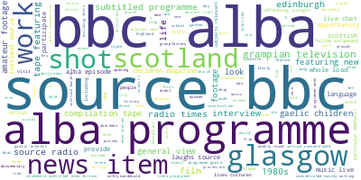
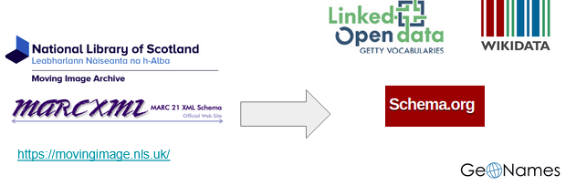
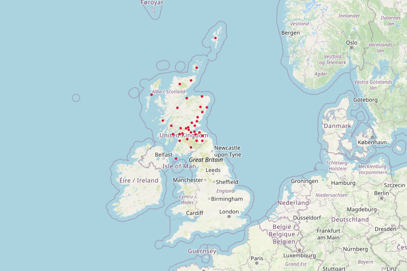

# National Librarian’s Research Fellowship in Digital Scholarship 2022-23

[](https://mybinder.org/v2/gh/hibernator11/nls/HEAD)

Created in October-December 2022 for the National Library of Scotland's Data Foundry by [Gustavo Candela, National Librarian’s Research Fellowship in Digital Scholarship 2022-23](https://data.nls.uk/projects/the-national-librarians-research-fellowship-in-digital-scholarship-2022-23/)


### Moving Image Archive

This dataset represents the descriptive metadata from the Moving Image Archive catalogue, which is Scotland’s national collection of moving images.

- Data format: metadata available as MARCXML and Dublin Core
- Data source: https://data.nls.uk/data/metadata-collections/moving-image-archive/

The Jupyter Notebooks include a set of examples to reproduce the transformation to RDF and enrichment with external repositories:

- [Data extraction](https://nbviewer.org/github/hibernator11/nls/blob/master/notebooks/MovingImageArchive-DataExtraction.ipynb)
- [Exploring the CSV text file](https://nbviewer.org/github/hibernator11/nls/blob/master/notebooks/MovingImageArchive-ExploringCSV.ipynb)
- [Transformation to LOD](https://nbviewer.org/github/hibernator11/nls/blob/master/notebooks/MovingImageArchive-TransformationToLOD.ipynb)
- [Enrichment](https://nbviewer.org/github/hibernator11/nls/blob/master/notebooks/MovingImageArchive-Enrichment.ipynb)
- [Exploring with SPARQL](https://nbviewer.org/github/hibernator11/nls/blob/master/notebooks/MovingImageArchive-ExploringSPARQL.ipynb)
- [Exploring geographic locations](https://nbviewer.org/github/hibernator11/nls/blob/master/notebooks/MovingImageArchive-ExploringGeographicLocations.ipynb)
- [Data Quality assessment](https://nbviewer.org/github/hibernator11/nls/blob/master/notebooks/MovingImageArchive-DataQuality.ipynb)




The transformation is based on the vocabulary [schema.org](https://schema.org/), using the entity [VideoObject](https://schema.org/VideoObject).




#### Map visualisation
Several approaches have been followed to create a map visualisation to show the locations named in the metadata provided in the dataset. First, the [Python library folium](http://python-visualization.github.io/folium/) has been used to create a map. 



A second approach, is based on Wikidata and uses the links to create a map as a result of a SPARQL query. Please, click the following link to see the visualisation <a href="https://w.wiki/5qa4">Wikidata</a>.

The SPARQL uses the instruction ```VALUES``` to use the links provided by the RDF data:

```
#defaultView:Map
PREFIX wd: <http://www.wikidata.org/entity/>
SELECT ?r ?rLabel (SAMPLE(?image) as ?img) (SAMPLE(?location) as ?l)
WHERE {   
  VALUES ?r {wd:Q793283 wd:Q207257 wd:Q211091 wd:Q980084 wd:Q17582129 wd:Q1247435 wd:Q652539 wd:Q2421 wd:Q23436 wd:Q1061313 wd:Q189912 wd:Q530296 wd:Q81052 wd:Q202177 wd:Q54809 wd:Q786649 wd:Q664892 wd:Q1247396 wd:Q1147435 wd:Q9177476 wd:Q47134 wd:Q3643362 wd:Q4093 wd:Q206934 wd:Q550606 wd:Q864668 wd:Q100166 wd:Q123709 wd:Q203000 wd:Q80967 wd:Q978599 wd:Q204940 wd:Q182923 wd:Q207268 wd:Q1229763 wd:Q376914 wd:Q106652 wd:Q36405 wd:Q201149 wd:Q1247384  }.

       ?r wdt:P625 ?location. # coordinates
       OPTIONAL {?r wdt:P18 ?image}.
          
    SERVICE wikibase:label { bd:serviceParam wikibase:language "en" }
} GROUP BY ?r ?rLabel ?img
```

### Data quality assessment
The RDF dataset has been assessed by means of SPARQL in several ways. For instance, counting the number of resources per type (e.g., person, organizatioonn, video, etc.) and comparing the results against the original sources. In addition, an innovative method to assess RDF repositories has been used based on [Shape Expressions (ShEx)](https://shexspec.github.io/primer/), a language for describing RDF graph structures. A ShEx schema describes constraints that RDF data graphs must meet in order to be considered conformant. A [ShEx schema](/shex/) has been created to describe the resources stored in the final RDF dataset.

```
shex:VideoObject
{
   rdf:type  [schema:VideoObject]  ;                           # 100.0 %
   dc:identifier  IRI  ;                                       # 100.0 %
   schema:sourceOrganization  IRI  ;                           # 100.0 %
   schema:identifier  IRI  ;                                   # 100.0 %
   schema:duration  xsd:string  ?;
            # 99.99514751552795 % obj: xsd:string. Cardinality: {1}
   schema:abstract  xsd:string  ?;
            # 99.85927795031056 % obj: xsd:string. Cardinality: {1}
   schema:name  xsd:string  ?;
            # 99.34006211180125 % obj: xsd:string. Cardinality: {1}
   dc:title  xsd:string  ?;
            # 99.34006211180125 % obj: xsd:string. Cardinality: {1}
   schema:videoQuality  xsd:string  ?
            # 98.3113354037267 % obj: xsd:string. Cardinality: {1}
}
```

### References

- https://movingimage.nls.uk/
- https://www.loc.gov/marc/bibliographic/bd040.html
- https://rdflib.readthedocs.io/en/stable/
